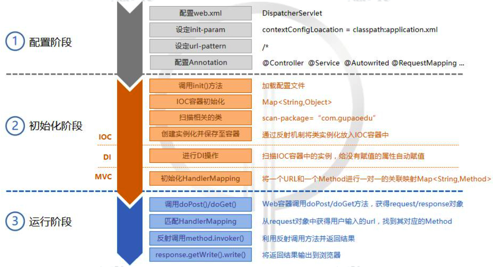
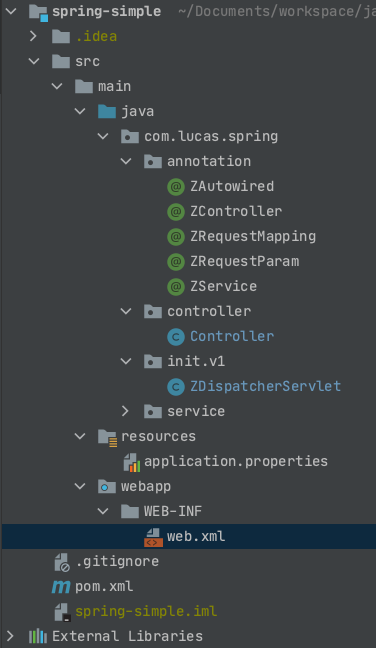

# 300行代码手写一个SpringMVC

前段时间看了一个视频课，是关于`Spring`源码的，其中就有一个`300`行手写`SpringMVC`的一堂课，我觉得挺棒的，就将大概的内容整理了一下，也就有了这篇文章的诞生；

下面实现的代码，是基于源码实现的思想写的，因此这边文章的重点也是理解源码中所用到的思想，而不是具体的实现代码；

## 基本实现思路

SpringMVC主要的实现部分分为三部分，配置、初始化和运行；

配置即为配置请求映射路径、配置需要加载的类的包路径等，例如`SSM`框架中需要配置`web.xml`文件等（`SpringBoot`实现了`web.xml`文件的自动配置）；

初始化主要是用来扫描类，初始化`Spring`容器、依赖注入等操作；

运行即为当请求到达后台，调用`doGet()`、`doPost()`方法，匹配请求路径，执行对应方法的操作；

下面是一个简化版的`SpringMvc`的实现流程；



## 配置阶段

这里默认已经添加了`Spring`的核心依赖和`Tomcat`依赖，`Servlet`是`tomcat`依赖包中的类，`SpringMVC`的核心功能类`DispatchServlet`需要依赖`Servlet`；

### 配置application.properties文件

这里为了解析方便，采用了`properties`文件来代替`yml`文件，主要配置需要初始化扫描的包路径；

```properties
scanPackage=com.lucas.spring
```

### 配置web.xml文件

在`Spring`中，所有依赖`web`容器的项目，都是从读取`web.xml`文件开始的，因此，这里需要先配置好`web.xml`；



下面是`web.xml`中的内容；

```xml
<?xml version="1.0" encoding="UTF-8"?>
<web-app xmlns:javaee="http://java.sun.com/xml/ns/javaee"
         xmlns:web="http://java.sun.com/xml/ns/javaee/web-app_2_5.xsd"
         xmlns:xsi="http://www.w3.org/2001/XMLSchema-instance"
         version="2.5">

    <display-name>Lucas Web Application</display-name>
    <!-- 置servlet，可以配置多个 -->
    <servlet>
        <servlet-name>zmvc</servlet-name>
        <servlet-class>com.lucas.spring.init.v1.ZDispatcherServlet</servlet-class>
        <!-- 初始化参数，可以配置多个 -->
        <init-param>
            <param-name>contextConfigLocation</param-name>
            <param-value>application.properties</param-value>
        </init-param>
        <load-on-startup>1</load-on-startup>
    </servlet>
    <!-- servlet映射，通过servlet-name与上面配置的servlet对应 -->
    <servlet-mapping>
        <servlet-name>zmvc</servlet-name>
        <url-pattern>/*</url-pattern>
    </servlet-mapping>
</web-app>
```

`ZDispatcherServlet`是我们自定义的类，主要是为了模仿实现`DispatchServlet`中的功能；

### 自定义注解Annoation

这里的自定义注解，主要是为了模仿`Spring`中的`@Controller`、`@Service`、`@RequestMapping`、`@RequestParam`、`@Autowired`注解，并模仿实现简化版的注解功能；

#### @ZController注解

```java
@Target({ElementType.TYPE})
@Retention(RetentionPolicy.RUNTIME)
@Documented
public @interface ZController {
}
```

#### @ZService注解

```Java
@Target({ElementType.TYPE})
@Retention(RetentionPolicy.RUNTIME)
@Documented
public @interface ZService {
    String value() default "";
}
```

#### @ZRequestMapping注解

```Java
@Target({ElementType.TYPE,ElementType.METHOD})
@Retention(RetentionPolicy.RUNTIME)
@Documented
public @interface ZRequestMapping {
    String value() default "";
}
```

#### @ZRequestParam注解

```java
@Target({ElementType.PARAMETER})
@Retention(RetentionPolicy.RUNTIME)
@Documented
public @interface ZRequestParam {
    String value() default "";
}
```

#### @ZAutowired注解

```java
@Target({ElementType.FIELD})
@Retention(RetentionPolicy.RUNTIME)
@Documented
public @interface ZAutowired {
    String value() default "";
}
```

### 自定义接口层

这里是自定义接口，用来模仿`Spring`中的`Controller`层，并通过上面的自定义注解实现相同的功能；

```java
@ZController
@ZRequestMapping("web")
public class Controller {

    @ZAutowired
    private Service service;
    @ZRequestMapping("/query")
    public void query(HttpServletRequest req, HttpServletResponse resp,
                      @ZRequestParam("name") String name){
        String result = service.get(name);
        try {
            resp.getWriter().write(result);
        } catch (IOException e) {
            e.printStackTrace();
        }
    }


    @ZRequestMapping("/add")
    public void add(HttpServletRequest req, HttpServletResponse resp,
                    @ZRequestParam("a") Integer a, @ZRequestParam("b") Integer b){
        try {
            resp.getWriter().write(a + "+" + b + "=" + (a + b));
        } catch (IOException e) {
            e.printStackTrace();
        }
    }
}
```

### 自定义业务层

这里相当于是`Spring`中的`Service`层；

```java
@ZService
public class Service {
    public String get(String name) {
        return "My name is " + name;
    }
}
```

## 初始化阶段